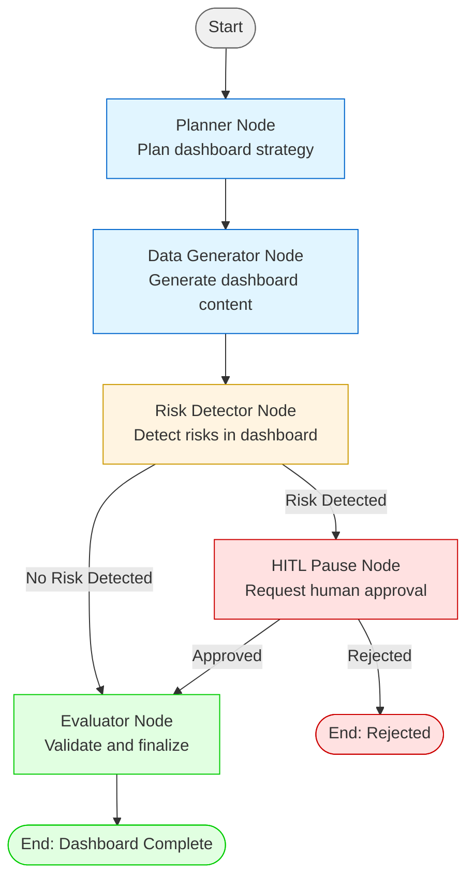

# Workflow Graph Documentation

This document describes the graph-based workflow system for agentic dashboard generation in Project ORBIT.

## Overview

The `WorkflowGraph` implements a directed graph workflow for dashboard creation with conditional branching, risk detection, and Human-in-the-Loop (HITL) approval mechanisms. It provides a structured, auditable approach to generating company dashboards.

## Workflow Diagram



## Workflow Nodes

### 1. Planner Node

**Purpose**: Plans the dashboard creation strategy and initializes company context.

**Responsibilities**:
- Extract or generate `company_id` from `company_name`
- Plan the dashboard generation approach
- Initialize workflow state

**Output**: Plan metadata with company information

**Next Nodes**: Always proceeds to `data_generator`

**Status**: `COMPLETED` on success, `FAILED` on error

---

### 2. Data Generator Node

**Purpose**: Generates the dashboard content using RAG pipeline.

**Responsibilities**:
- Retrieve company context from vector database (Pinecone)
- Generate dashboard markdown using RAG pipeline
- Create comprehensive dashboard with required sections:
  - Company Overview
  - Business Model and GTM
  - Funding & Investor Profile
  - Growth Momentum
  - Visibility & Market Sentiment
  - Risks and Challenges
  - Outlook
  - Disclosure Gaps

**Output**: Generated dashboard markdown stored in `state.dashboard`

**Next Nodes**: Always proceeds to `risk_detector`

**Status**: `COMPLETED` on success, `FAILED` on error

---

### 3. Risk Detector Node

**Purpose**: Detects potential risks in the generated dashboard and company data.

**Responsibilities**:
- Analyze dashboard content for risk signals
- Search company data for risk indicators
- Check retrieved context for risk patterns
- Aggregate and deduplicate risk signals

**Output**: 
- `risk_detected`: Boolean indicating if risks were found
- `risk_count`: Number of unique risks detected
- `risks`: List of risk signal objects

**Next Nodes**: 
- **If risk detected**: Proceeds to `hitl_pause`
- **If no risk**: Proceeds to `evaluator`

**Status**: `COMPLETED` on success, `FAILED` on error

---

### 4. HITL Pause Node

**Purpose**: Pauses workflow for human approval when risks are detected.

**Responsibilities**:
- Create approval request with risk details
- Save approval request to file system (`data/hitl_approvals/`)
- Wait for human decision (approve/reject)
- Update workflow state based on decision

**Output**:
- `approved`: Boolean indicating approval decision
- `approval_id`: Unique identifier for the approval request

**Next Nodes**:
- **If approved**: Proceeds to `evaluator`
- **If rejected**: Workflow ends (no next nodes)

**Status**: 
- `COMPLETED` if approved
- `COMPLETED` if rejected (workflow ends)
- `FAILED` on error

**HITL File Format**:
```json
{
  "approval_id": "hitl_20250115_103000_anthropic",
  "company_name": "Anthropic",
  "company_id": "anthropic",
  "risk_count": 3,
  "risks": [
    {
      "risk_type": "layoff_signal",
      "severity": "high",
      "description": "Recent layoff announcements detected"
    }
  ],
  "dashboard_preview": "## Company Overview\n...",
  "requested_at": "2025-01-15T10:30:00Z",
  "approved": null
}
```

---

### 5. Evaluator Node

**Purpose**: Validates and finalizes the dashboard.

**Responsibilities**:
- Validate dashboard has all required sections
- Check dashboard completeness
- Generate evaluation report
- Finalize workflow state

**Output**:
- `dashboard_complete`: Boolean indicating all sections present
- `missing_sections`: List of missing sections (if any)
- `risk_detected`: Whether risks were detected
- `risk_count`: Number of risks found
- `hitl_approved`: Whether HITL approval was obtained (if applicable)

**Next Nodes**: None (workflow complete)

**Status**: `COMPLETED` on success, `FAILED` on error

---

## Workflow Execution Flow

### Standard Path (No Risk)

```
Start → Planner → DataGenerator → RiskDetector → Evaluator → End
```

**Duration**: ~5-8 minutes  
**Status**: `COMPLETED`

### Risk Path (With HITL)

```
Start → Planner → DataGenerator → RiskDetector → HITLPause → [Wait for Approval] → Evaluator → End
```

**Duration**: ~5-8 minutes + human review time  
**Status**: `APPROVED` → `COMPLETED` (if approved) or `REJECTED` (if rejected)

### Error Path

```
Start → [Any Node] → [Node Fails] → End
```

**Status**: `FAILED`

---

## Workflow State

The `WorkflowState` object tracks the complete state of workflow execution:

```python
@dataclass
class WorkflowState:
    company_name: str
    company_id: Optional[str] = None
    status: WorkflowStatus = WorkflowStatus.NOT_STARTED
    current_node: Optional[str] = None
    node_results: Dict[str, NodeResult] = {}
    dashboard: Optional[str] = None
    risk_detected: bool = False
    risk_signals: List[Dict] = []
    hitl_approval_id: Optional[str] = None
    hitl_approved: Optional[bool] = None
    started_at: datetime
    completed_at: Optional[datetime] = None
```

### Workflow Status Values

- `NOT_STARTED`: Workflow not yet begun
- `RUNNING`: Workflow in progress
- `PAUSED_FOR_APPROVAL`: Waiting for HITL approval
- `APPROVED`: HITL approval granted, workflow continuing
- `REJECTED`: HITL approval denied, workflow terminated
- `COMPLETED`: Workflow finished successfully
- `FAILED`: Workflow failed due to error

---

## Node Result Structure

Each node returns a `NodeResult`:

```python
@dataclass
class NodeResult:
    node_name: str
    status: NodeStatus  # PENDING, RUNNING, COMPLETED, FAILED, SKIPPED
    output: Optional[Any] = None
    error: Optional[str] = None
    metadata: Dict[str, Any] = {}
    timestamp: datetime
```

### Node Status Values

- `PENDING`: Node not yet executed
- `RUNNING`: Node currently executing
- `COMPLETED`: Node finished successfully
- `FAILED`: Node encountered an error
- `SKIPPED`: Node was skipped (not applicable)

---

## Execution Algorithm

The workflow executes using a simple graph traversal algorithm:

```python
1. Initialize WorkflowState with company_name and company_id
2. Set current_node = "planner"
3. While current_node is not None:
   a. Execute current_node.execute(state)
   b. Store result in state.node_results
   c. If node failed, set status = FAILED and break
   d. Get next nodes: next_nodes = node.get_next_nodes(state)
   e. If no next nodes, break (workflow complete)
   f. Set current_node = next_nodes[0]
4. Set status = COMPLETED (if not already FAILED or REJECTED)
5. Return state
```

**Cycle Detection**: The algorithm tracks visited nodes to prevent infinite loops.

---

## Integration with SupervisorAgent

The `WorkflowGraph` is executed via `SupervisorAgent.execute_workflow()`:

```python
supervisor = SupervisorAgent(
    mcp_url="http://mcp-server:8000",
    mcp_api_key="your-api-key"
)

result = await supervisor.execute_workflow(
    company_name="Anthropic",
    company_id="anthropic"
)

# Result contains:
# - trace: ReActTrace (for logging/monitoring)
# - workflow_state: WorkflowState (detailed execution info)
# - dashboard: str (the generated dashboard markdown)
# - risk_detected: bool
# - execution_path: List[str] (nodes executed)
```

---

## Conditional Branching Logic

### Risk Detector Branching

```python
def get_next_nodes(self, state: WorkflowState) -> List[str]:
    if state.risk_detected:
        return ["hitl_pause"]  # Risk path
    else:
        return ["evaluator"]   # Standard path
```

### HITL Pause Branching

```python
def get_next_nodes(self, state: WorkflowState) -> List[str]:
    if state.hitl_approved:
        return ["evaluator"]  # Continue after approval
    else:
        return []  # End workflow if rejected
```

---

## Error Handling

### Node-Level Errors

If a node fails:
1. Node sets `status = FAILED`
2. Node returns `NodeResult` with `error` field populated
3. Workflow sets `state.status = FAILED`
4. Workflow terminates immediately
5. `state.completed_at` is set to current time

### Workflow-Level Errors

If an exception occurs during workflow execution:
1. Exception is caught and logged
2. `state.status = FAILED`
3. `state.completed_at` is set
4. State is returned (partial results may be available)

---

## Execution Path Tracking

The workflow tracks which nodes were executed:

```python
execution_path = workflow.get_execution_path(state)
# Returns: ["planner", "data_generator", "risk_detector", "evaluator"]
```

This is useful for:
- Debugging workflow execution
- Monitoring which paths were taken
- Performance analysis
- Audit trails

---

## Visualization

The workflow graph can be visualized using Mermaid:

```python
mermaid_diagram = workflow.visualize_graph()
# Returns Mermaid diagram code (see diagram above)
```

---

## Best Practices

1. **Always check `state.status`** before using `state.dashboard`
2. **Review `state.node_results`** for detailed execution information
3. **Check `state.risk_detected`** to understand if HITL was triggered
4. **Use `execution_path`** for debugging and monitoring
5. **Handle `FAILED` and `REJECTED` statuses** appropriately
6. **Store `WorkflowState`** for audit and debugging purposes

---

## Example: Complete Workflow Execution

```python
from agents.workflow import WorkflowGraph

# Initialize workflow
workflow = WorkflowGraph(
    mcp_url="http://mcp-server:8000",
    mcp_api_key="your-api-key"
)

# Execute workflow
state = await workflow.execute(
    company_name="Anthropic",
    company_id="anthropic"
)

# Check results
if state.status == WorkflowStatus.COMPLETED:
    print(f"Dashboard generated: {len(state.dashboard)} characters")
    print(f"Risks detected: {state.risk_detected}")
    print(f"Execution path: {workflow.get_execution_path(state)}")
elif state.status == WorkflowStatus.REJECTED:
    print("Workflow rejected during HITL approval")
elif state.status == WorkflowStatus.FAILED:
    print(f"Workflow failed: {state.node_results[state.current_node].error}")
```

---

## Future Enhancements

Potential improvements to the workflow system:

1. **Parallel Node Execution**: Execute independent nodes in parallel
2. **Dynamic Node Addition**: Add nodes at runtime based on conditions
3. **Sub-workflows**: Nest workflows within workflows
4. **Retry Logic**: Automatic retry for failed nodes
5. **Timeout Handling**: Timeout for long-running nodes
6. **Metrics Collection**: Detailed performance metrics per node
7. **Workflow Templates**: Pre-defined workflow templates for different use cases

